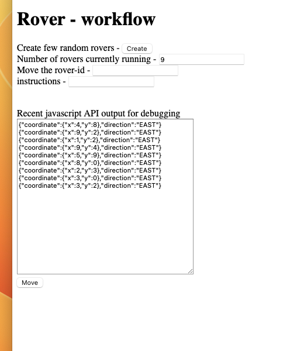
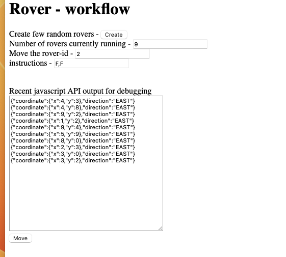
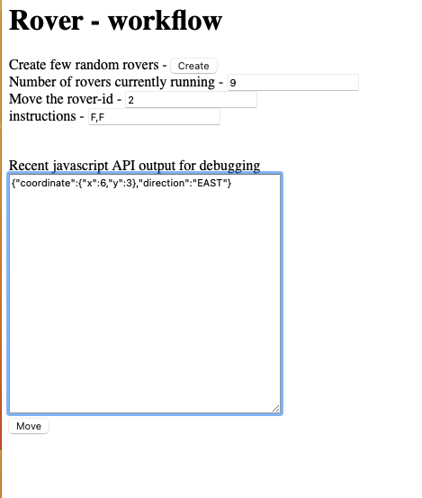

## How to test code
1. Use the url in as per readme.md (with adjusted port)
   1. [Create 1st Rower](http://127.0.0.1:8080/rover/create?direction=E&x=3&y=5)
   2. [Create 2nd Rower](http://127.0.0.1:8080/rover/create?direction=E&x=3&y=5)
   3. [Navigate first rovers](http://127.0.0.1:8080/rover/navigate?id=1&commands=F,L,F,R,F)
   4. [Navigate one of the rovers](http://127.0.0.1:8080/rover/navigate?id=1&commands=F,F,F,R,F)
2. Or use the web - page with developer console for the network activity

## Test using simple html page   
1. Create few random rovers
   1. 
2. Once count is more than 3, move the 2nd rover
   1. 
3. Move the 3rd rover one more time (result is appended to the top, first line is recent)
4. 
   
## Note
1. Html and javascript has lots of bug, it is poorman debug tool
   1. We can use network tab on devtools if required
2. Textarea will be keep appended to compare with prior result
3. We can delete text inside textarea for future API result alone